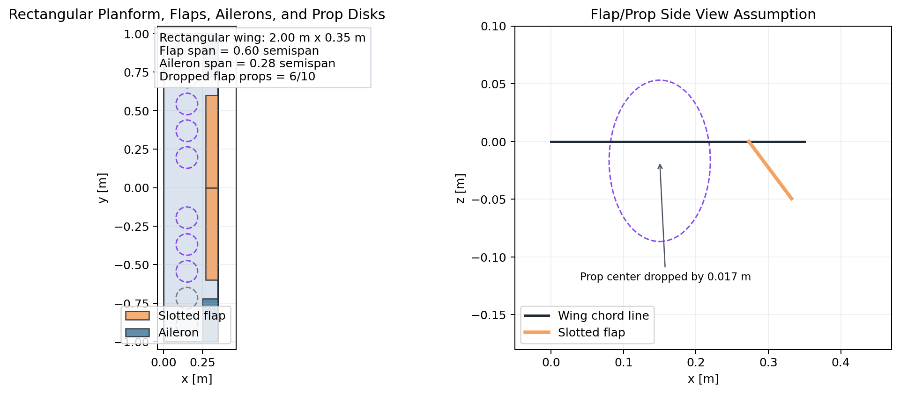
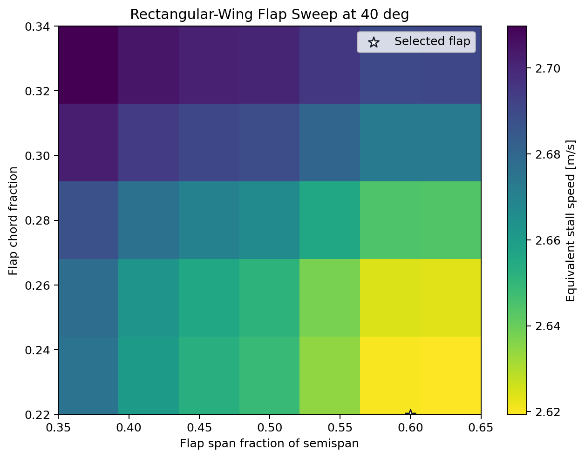
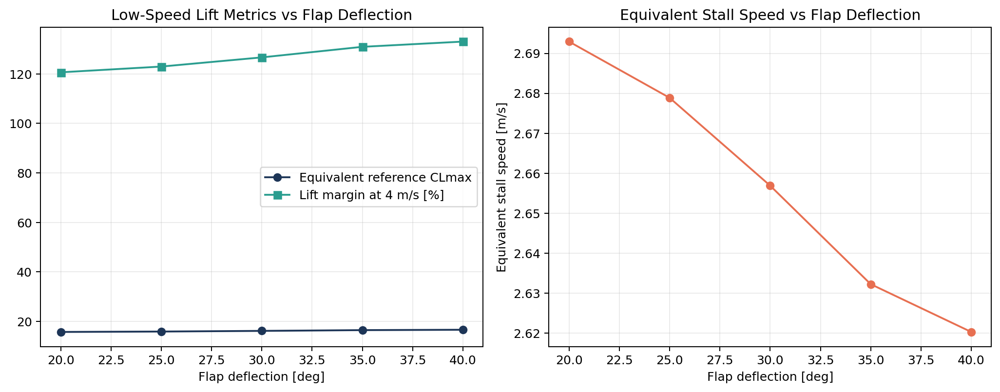
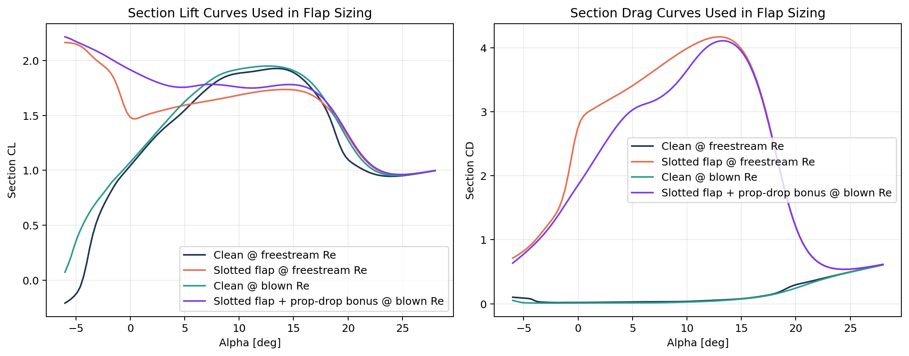
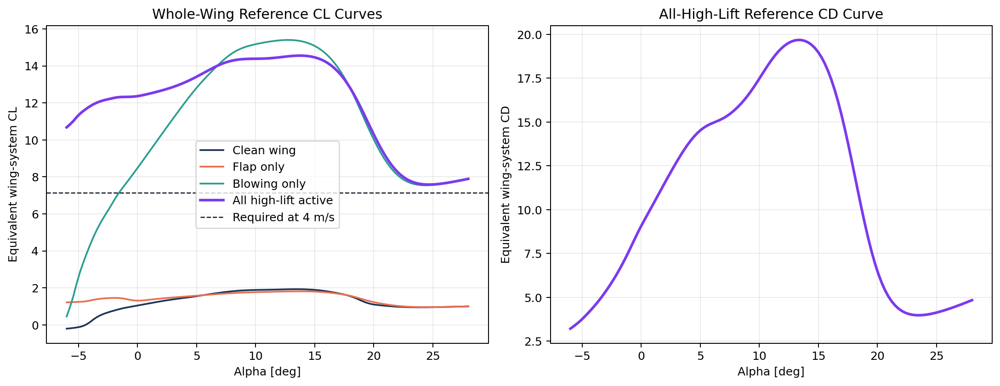
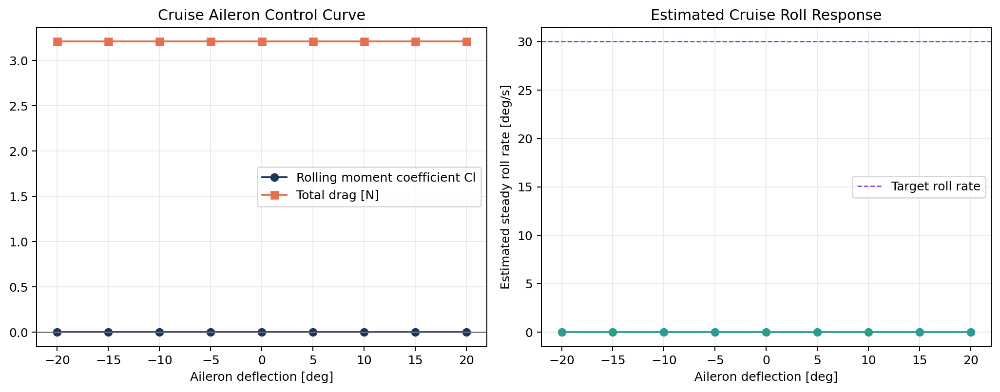

# Rectangular-Wing Control Surface Sizing: Rank 6

## Selected propulsion concept

- Rank: `6`
- Prop layout: `10 x 5.5 x 2.2 in`
- Prop family: `balanced`
- Blade count metadata: `3`
- Low-speed RPM: `9695.8`
- Cruise RPM: `9564.5`
- Available low-speed blown velocity: `14.62 m/s`
- Low-speed induced velocity from actuator-disk relation: `5.31 m/s`
- Required low-speed blown velocity from Stage 1: `9.47 m/s`

## Rectangular-wing assumptions

- Span: `2.00 m`
- Chord: `0.35 m`
- Wing area: `0.700 m^2`
- Slotted flap modeling: `NeuralFoil flap polar + heuristic slot gain`
- Low-speed flap assumption: `max slotted flap deflection = 40.0 deg`
- Prop drop ahead of flap: `0.017 m` for props that lie inside the flap span

## Recommended flap

- Span fraction of semispan: `0.60`
- End station: `0.600 m`
- Chord fraction: `0.22`
- Deflection: `40.0 deg`
- Flap area: `0.420 m^2`
- Blown flap area: `0.235 m^2`
- Equivalent reference CLmax: `16.657`
- Equivalent stall speed: `2.620 m/s`
- Lift margin at 4 m/s: `133.0 %`

## Recommended aileron

- Span fraction of semispan: `0.28`
- Start station: `0.720 m`
- Chord fraction: `0.28`
- Aileron area: `0.055 m^2`
- Trim alpha at 10 m/s: `6.00 deg`
- Rolling moment derivative: `0.001717 /deg`
- Roll damping derivative: `-0.4458`
- Estimated roll rate at 14 deg: `30.9 deg/s`
- Estimated roll rate at 20 deg: `44.1 deg/s`
- Internal target roll rate for sizing: `30.0 deg/s`

## Artifacts

- Layout plot: 

- Flap heatmap: 

- Flap curves: 

- Section polars: 

- Whole-wing CL/CD curve: 

- Aileron curves: 

## Notes

- The blade-count input is tracked as metadata only in this script; the current Stage 1/2 prop surrogate does not explicitly model blade count.
- The slotted-flap gain and prop-drop benefit are heuristic modifiers layered on top of NeuralFoil flap polars. They are meant for concept sizing, not certification-level high-lift prediction.
- The aileron sizing is evaluated at cruise trim using AeroSandbox VLM on the rectangular wing. The report uses an estimated steady roll rate based on VLM aileron effectiveness and roll-damping derivative.