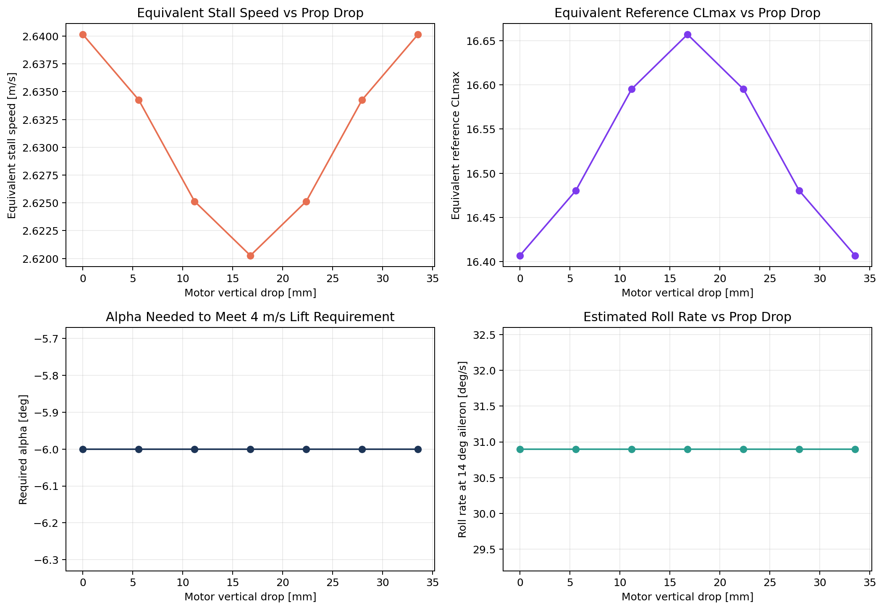
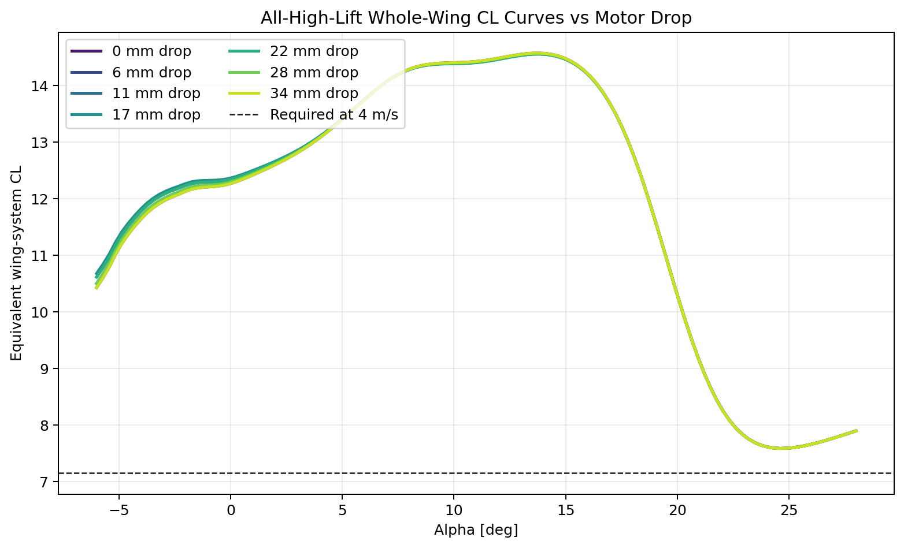
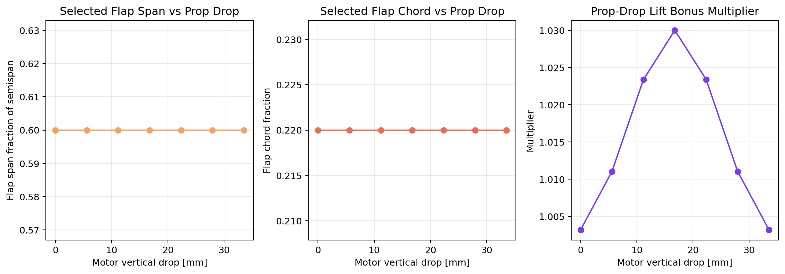

# Motor Height Trade Study: Rank 6

- Prop concept: `10 x 5.5 x 2.2 in`

## Key takeaways

- Best equivalent stall speed occurred at `17 mm` drop: `2.620 m/s`.
- Highest 14 deg roll-rate estimate occurred at `0 mm` drop: `30.9 deg/s`.

## Artifacts

- Metric plot: 

- Whole-wing CL overlay: 

- Geometry/bonus plot: 

## Notes

- This trade keeps the selected propulsion architecture and the selected rectangular slotted-flap/aileron geometry fixed while sweeping only motor vertical drop.
- The vertical-drop effect enters through the heuristic prop-drop lift bonus used on the blown flap section. The bonus peaks near the baseline drop and fades when the motor is too high or too low.
- These results are concept-level sensitivity trends, not a CFD-calibrated vertical-placement optimum.