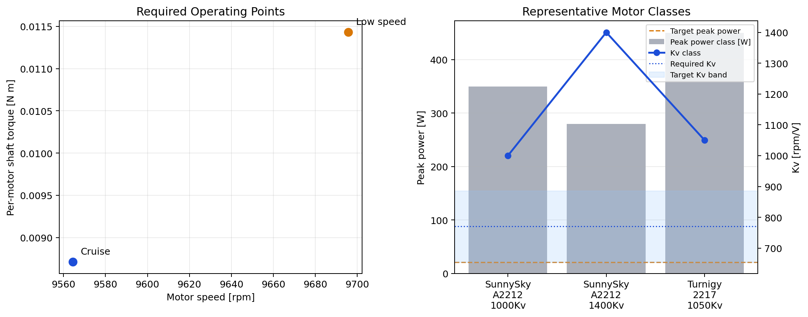

# Motor Targeting: Rank 6

## Selected propulsion concept

- Prop layout: `10 x 5.5 x 2.2 in`
- Prop family: `balanced`
- Low-speed RPM: `9695.8`
- Cruise RPM: `9564.5`
- Low-speed torque per motor: `0.01143 N m`
- Cruise torque per motor: `0.00871 N m`

## Motor target specification

- Required Kv from current Stage 1 model: `770.7 rpm/V`
- Recommended Kv band (heuristic): `655.1` to `886.3 rpm/V`
- Required peak electrical power per motor: `17.1 W`
- Target peak electrical power per motor (1.25x): `21.4 W`
- Required peak shaft power per motor: `11.6 W`
- Required peak current per motor: `1.16 A`
- Target continuous current per motor (1.25x): `1.45 A`
- Estimated motor mass from fit at target power: `5.5 g`

## Recommended representative classes

- Best motor class match: `SunnySky_A2212_1000Kv`
  Peak power = `350 W`, Kv = `1000 rpm/V`, mass = `58.0 g`
- Best ESC class match: `mini_BLHeli_S_8A`
  Continuous current = `8 A`, mass = `5.0 g`

## Candidate files

- Summary plot: 

## Notes

- These are representative motor and ESC classes selected from the local sizing datasets, not final vendor picks.
- The motor class dataset is based on representative published specifications from T-Motor, SunnySky, Turnigy, Tiger Motor, and EMAX, as documented in `data/motors/motor_mass.csv`.
- The ESC class dataset is based on representative current/mass points documented in `data/motors/esc_mass.csv`.
- The Kv band and the 1.25x power/current factors are engineering sizing heuristics used to turn the Stage 1 operating point into a procurement target sheet.