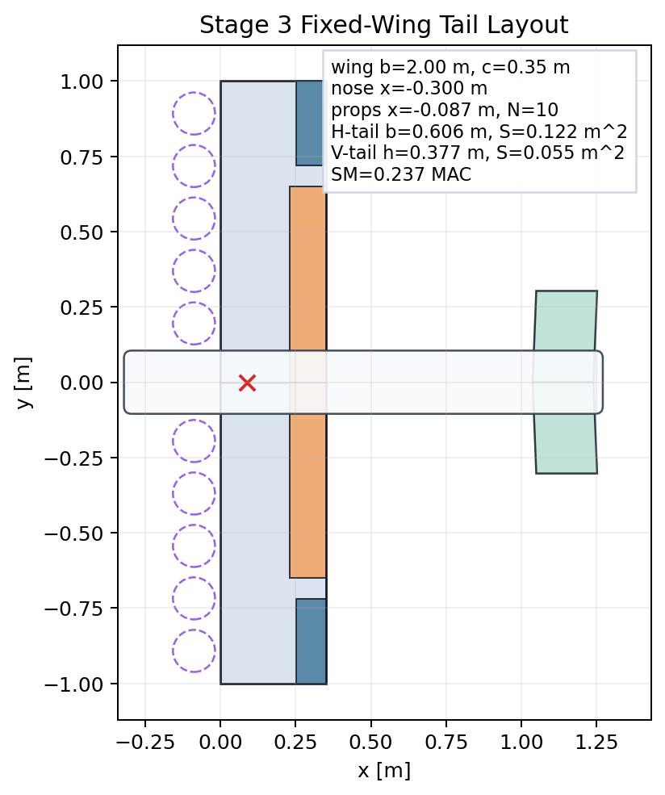
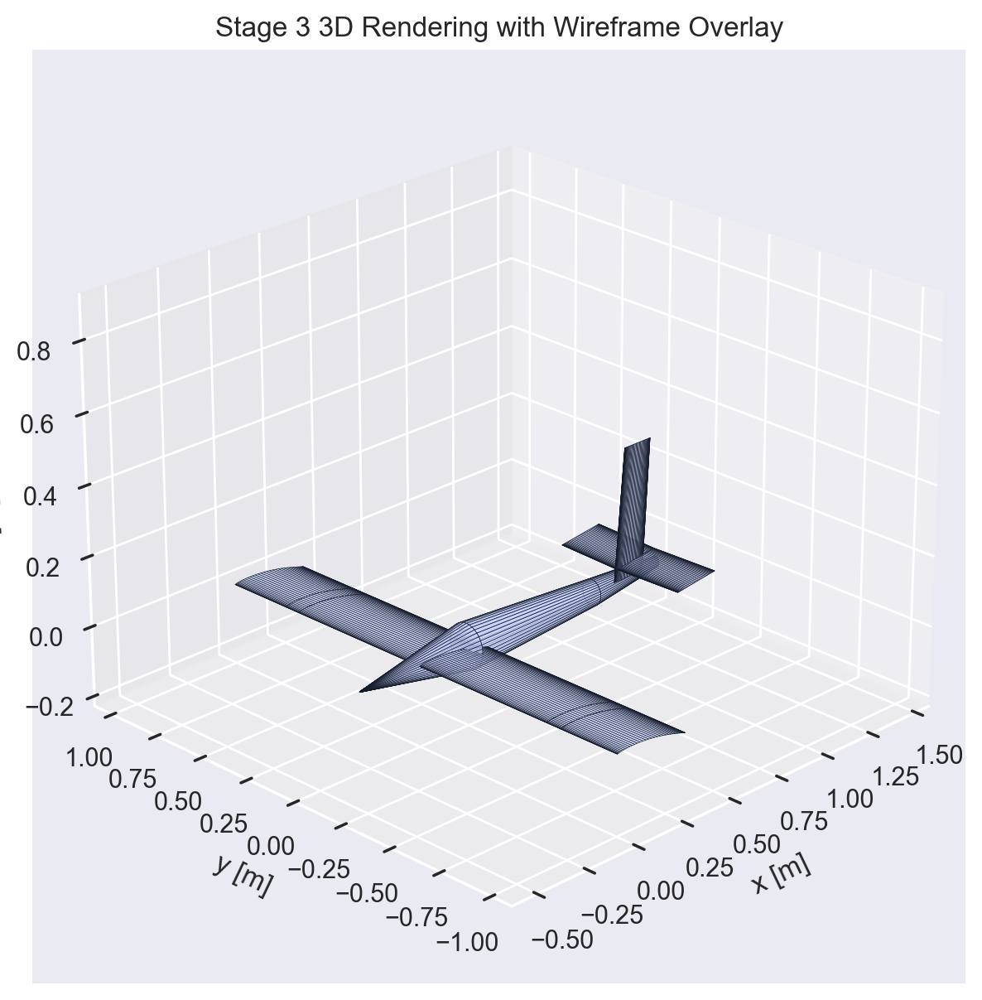
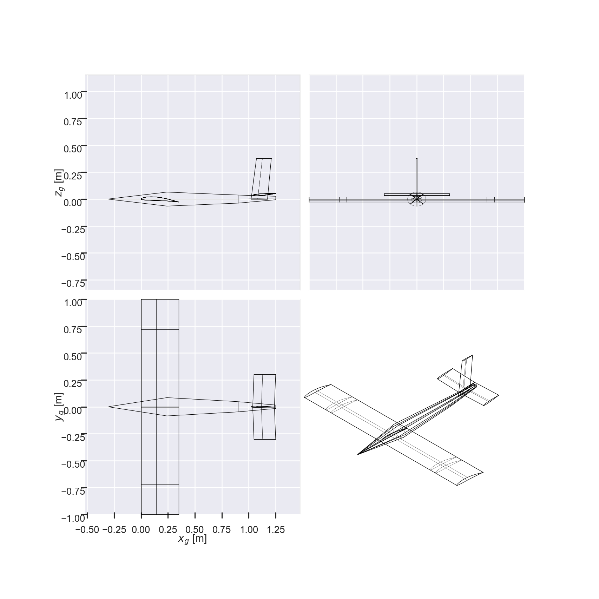
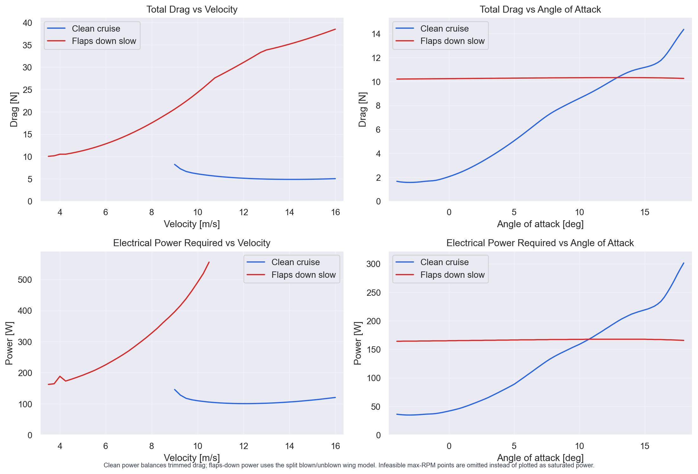
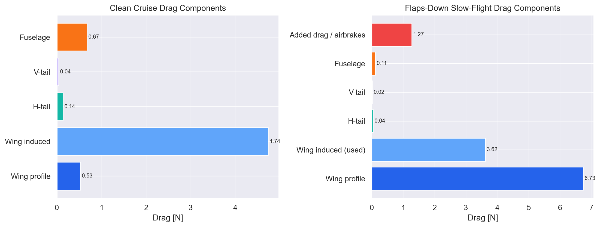

# Stage 3 Gallery

Generated from the fixed-wing AeroSandbox tail/material refinement pass.

## Rank 1: 10 props, 5.5 in, balanced

- Airfoil: `DAE51`
- Wing: `2.0 m` span x `0.35 m` chord
- H-tail: `0.6061513482763291 m` span, `0.20205044942544306 m` root chord, `0.20205044942544306 m` tip chord
- V-tail: `0.3767861962696503 m` height, `0.15236383313892232 m` root chord, `0.13747170245312365 m` tip chord
- Cruise power: `112.09693847656251 W`
- Slow-flight power: `188.41739550781253 W`

