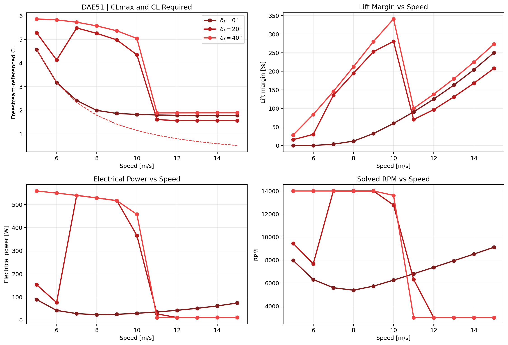
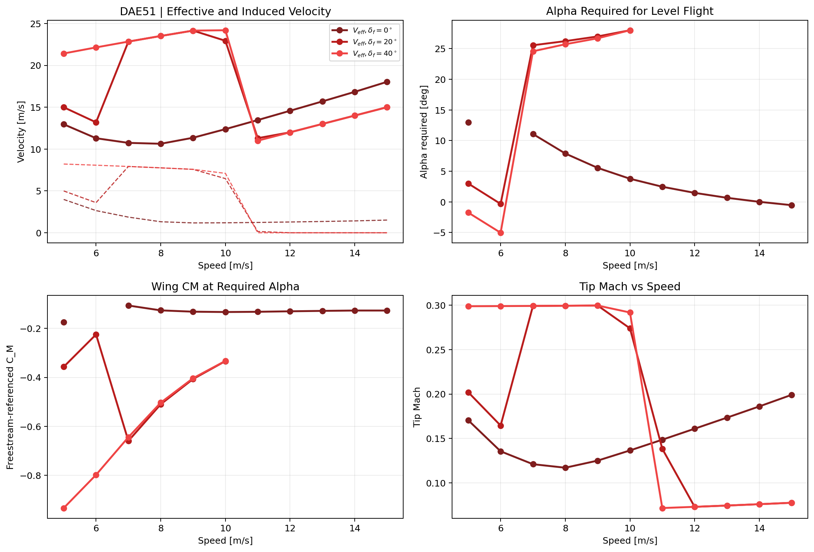
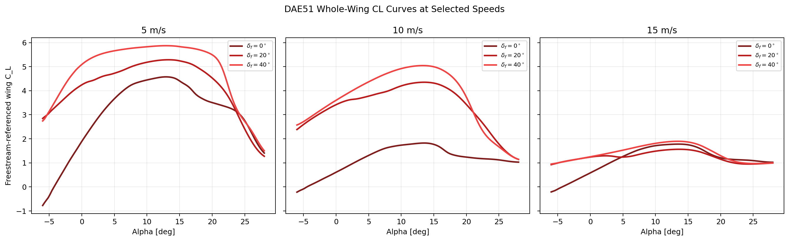

# Frozen-Geometry Speed Sweep | DAE51

- Flap geometry held fixed at `span=0.65` semispan and `c_f/c=0.34`.
- Aileron geometry held fixed at `span=0.28` semispan and `c_a/c=0.28`.
- Motor drop held fixed at `42 mm` (`0.12 c`).
- RPM is re-solved at each speed for each flap state using trimmed level-flight thrust closure.

## Artifacts

- Summary CSV: [speed_sweep_summary.csv](speed_sweep_summary.csv)
- Curve CSV: [speed_sweep_curves.csv](speed_sweep_curves.csv)
- Performance plot: 

- Operating-point plot: 

- Selected-speed CL curves: 

## Notes

- The strongest high-lift branch in the sweep occurred near `5 m/s` with `CLmax = 5.870` and `Vstall = 4.414 m/s`.
- The `0°`, `20°`, and `40°` branches are all evaluated with the same frozen wing/control geometry so only the operating point and flap deflection change across the sweep.