# Airfoil Blowing Comparison

This study compares `S1210`, `Epler E423`, `DAE51`, `NACA 0012`, `NACA 2412` under the current blown-wing low-speed assumptions.

## Assumptions

- Freestream speed: `4.0 m/s`
- Chord used for section Reynolds number: `0.35 m`
- Representative prop layout for mapping `C_mu -> V_eff`: `10 x 5.5 in`
- Flap deflections compared: `0 deg` and `40 deg`
- Blowing levels: `0.0, 0.5, 1.0, 1.5, 2.0, 2.5` in `C_mu` increments
- Slotted flap model: `NeuralFoil flap polar + staged slotted-flap correction`
- Representative motor height for wing-level summary: `0.042 m` (`0.120 c`)
- Freestream-referenced blown section `c_l` is smoothly limited to about `9.0` to stay within the order of magnitude reported by 2D blown-flap wind-tunnel data
- Representative wing summary uses a Cambridge-style uniform-jet immersion model with a blown-area fraction of about `55.9%` and flap span fraction `60%`

## Outputs

- Curve CSV: [airfoil_curve_data.csv](airfoil_curve_data.csv)
- Summary CSV: [airfoil_metric_summary.csv](airfoil_metric_summary.csv)
- Cross-airfoil summary: 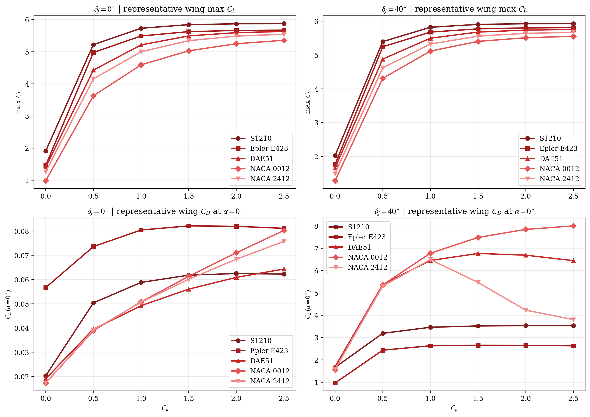
- The per-airfoil response grids are 2D section response plots.
- The cross-airfoil summary plot uses a representative wing-area integration so airfoil ranking is not driven only by section-max scaling.

## S1210

- `c_l/c_d/c_m` grid: 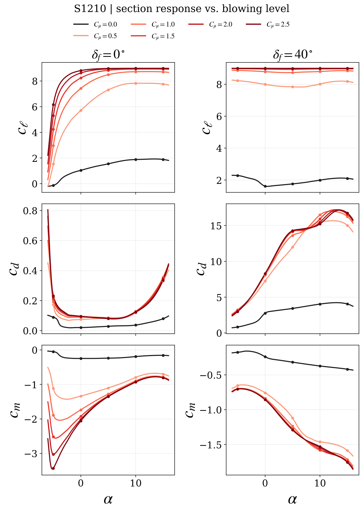

- paper-style `c_l/c_x/c_m` grid: 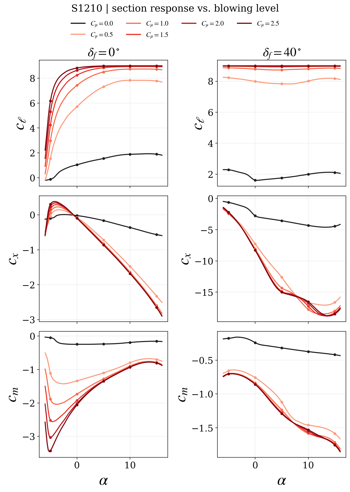

- legacy-style clean polar folder: `outputs/wing_workflow/airfoil_frontend/legacy_style_polars/s1210`

## Epler E423

- `c_l/c_d/c_m` grid: 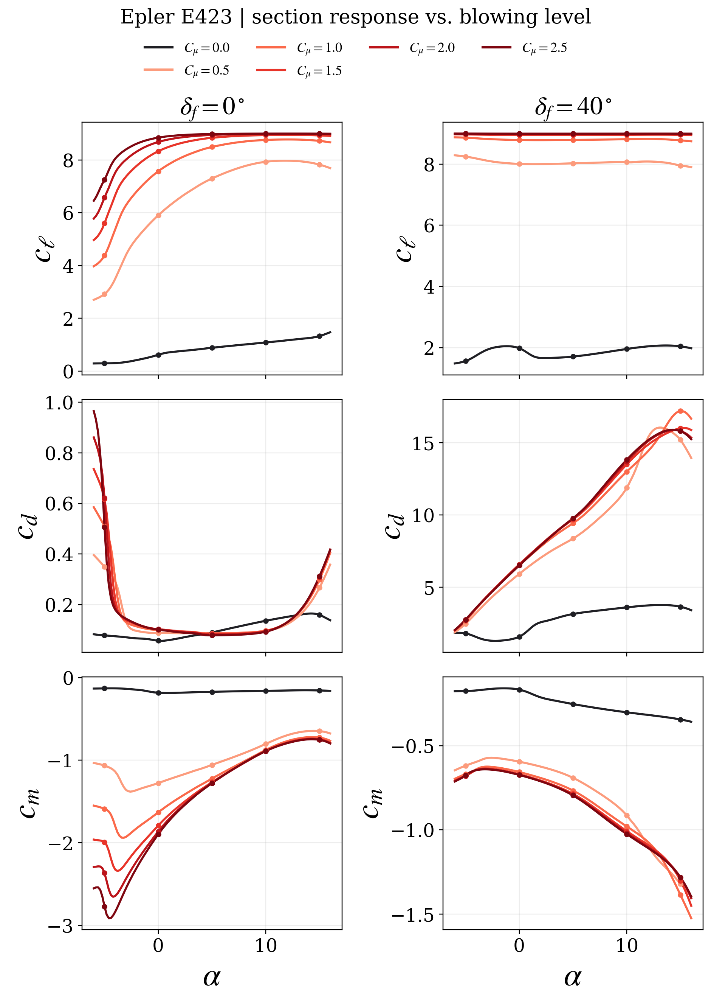

- paper-style `c_l/c_x/c_m` grid: 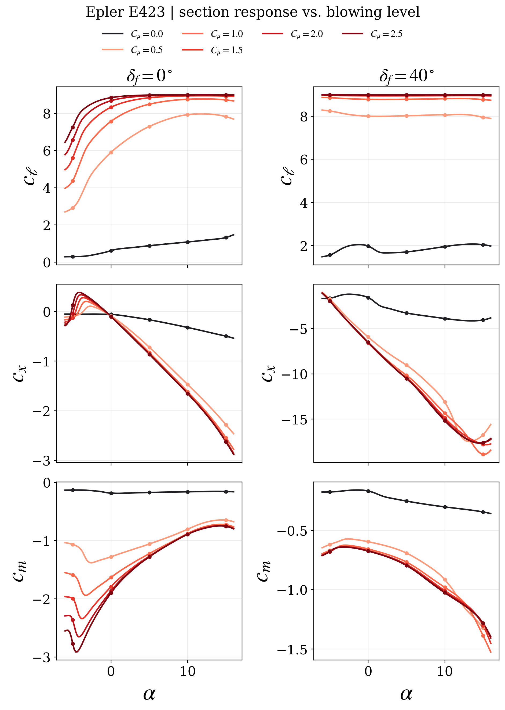

- legacy-style clean polar folder: `outputs/wing_workflow/airfoil_frontend/legacy_style_polars/e423`

## DAE51

- `c_l/c_d/c_m` grid: 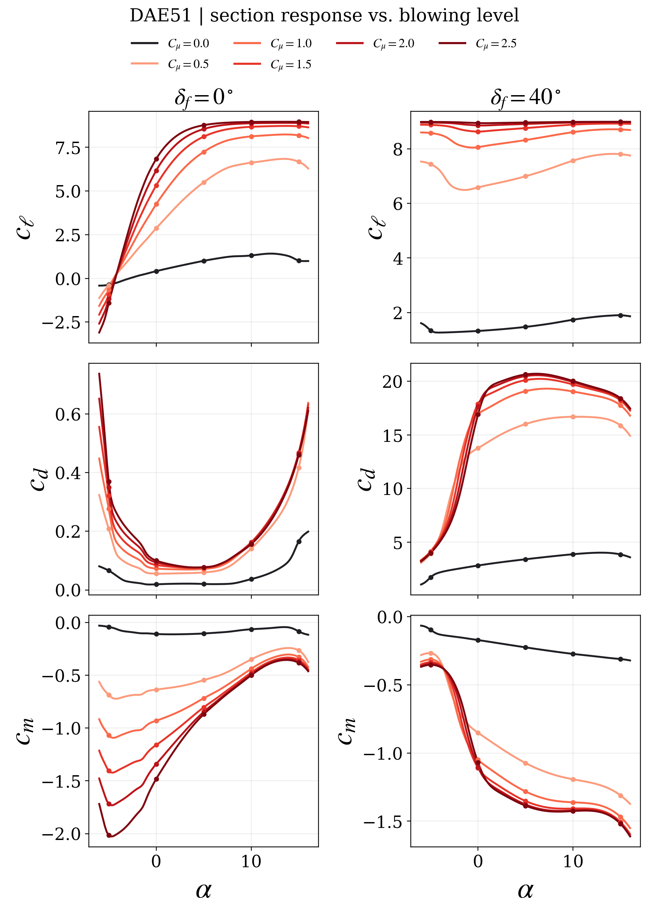

- paper-style `c_l/c_x/c_m` grid: 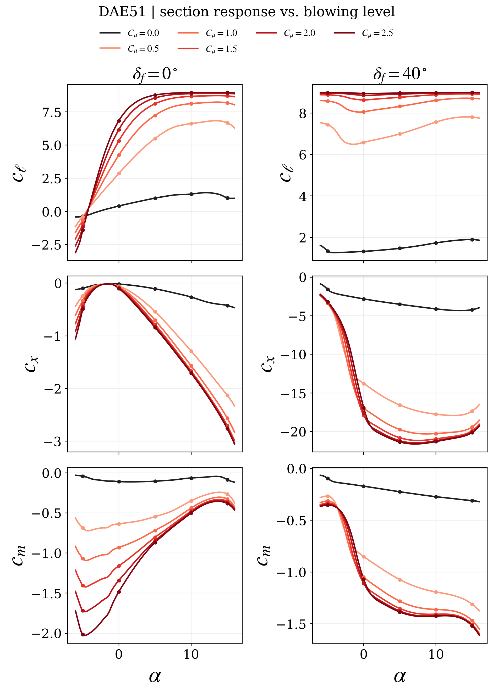

- legacy-style clean polar folder: `outputs/wing_workflow/airfoil_frontend/legacy_style_polars/dae51`

## NACA 0012

- `c_l/c_d/c_m` grid: 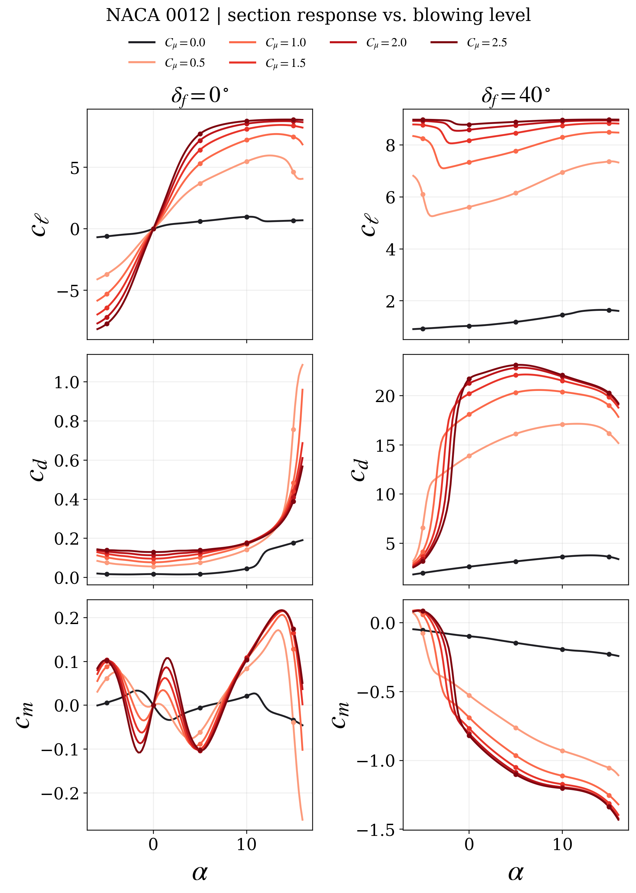

- paper-style `c_l/c_x/c_m` grid: 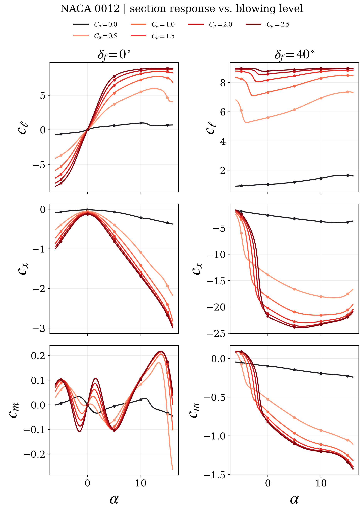

- legacy-style clean polar folder: `outputs/wing_workflow/airfoil_frontend/legacy_style_polars/naca0012`

## NACA 2412

- `c_l/c_d/c_m` grid: 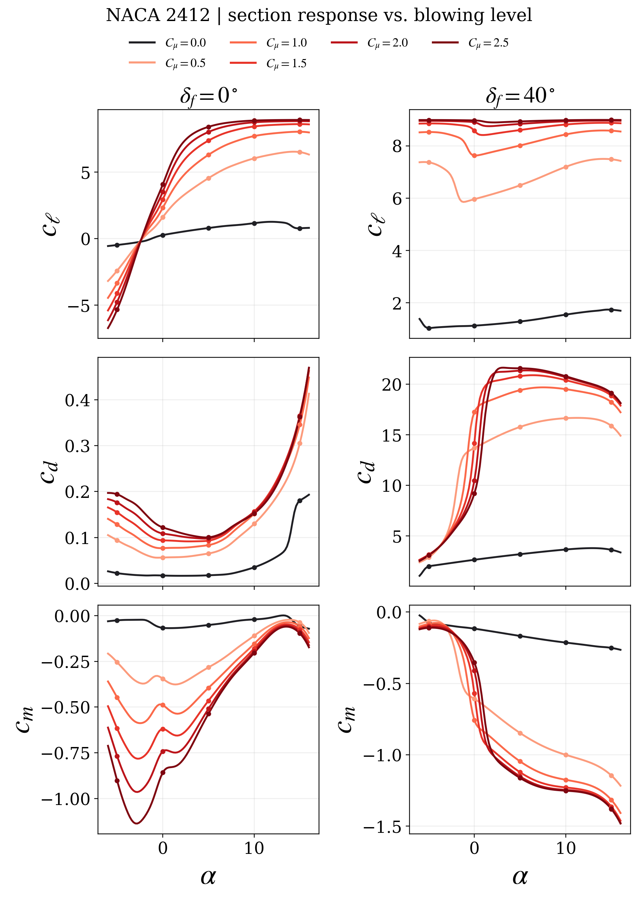

- paper-style `c_l/c_x/c_m` grid: 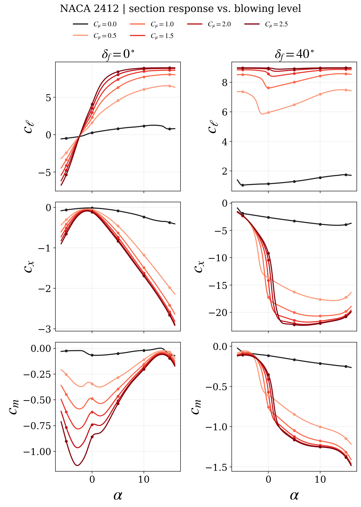

- legacy-style clean polar folder: `outputs/wing_workflow/airfoil_frontend/legacy_style_polars/naca2412`
