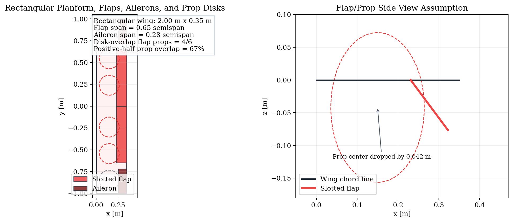
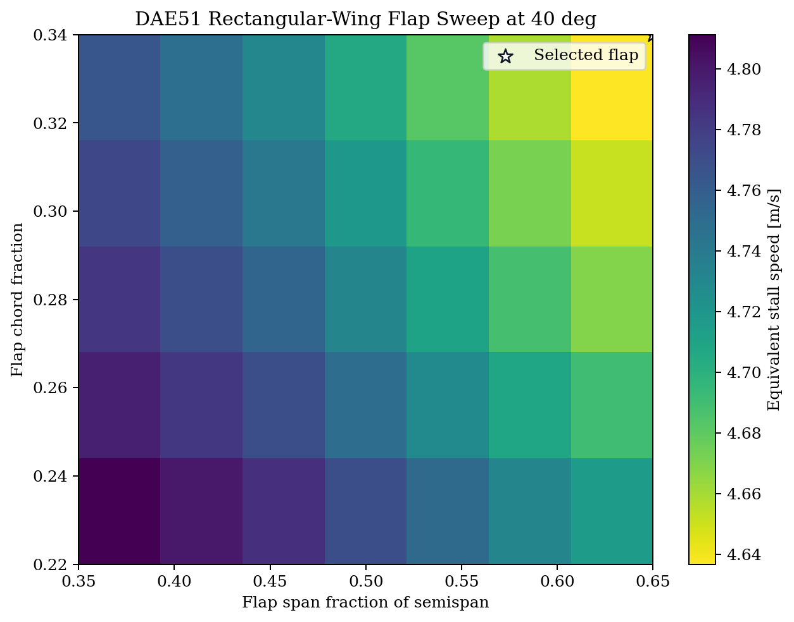
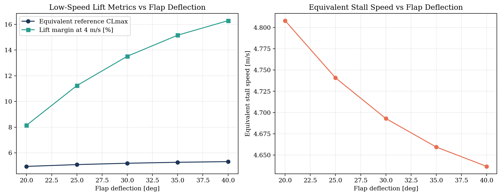
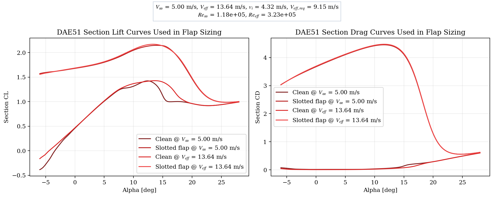
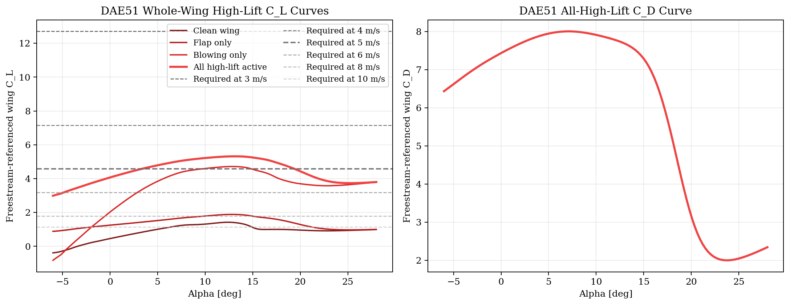
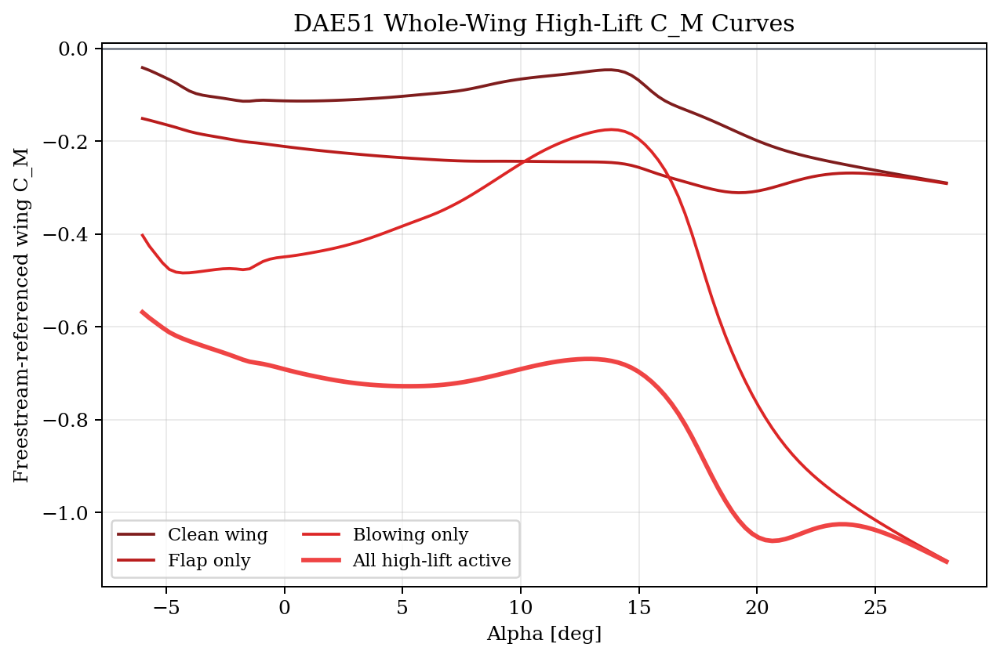
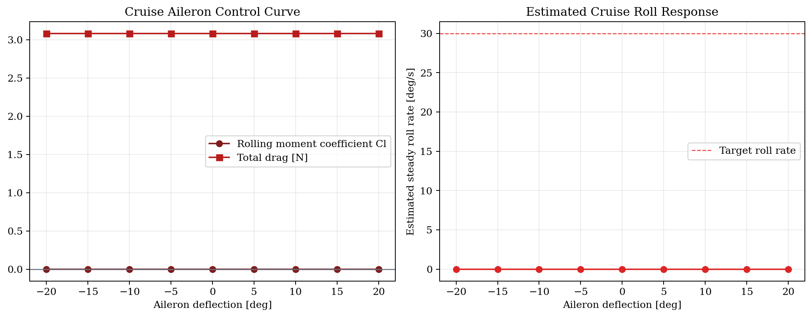
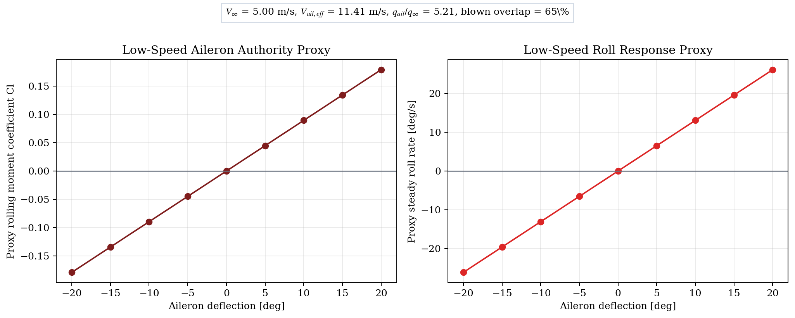

# Rectangular-Wing Control Surface Sizing: Rank 1

## Selected propulsion concept

- Wing airfoil: `DAE51`
- Rank: `1`
- Prop layout: `6 x 9.0 x 3.6 in`
- Prop family: `cruise`
- Blade count metadata: `3`
- Low-speed RPM: `5140.1`
- Cruise RPM: `4962.9`
- Available low-speed blown velocity: `13.64 m/s`
- Low-speed induced velocity from actuator-disk relation: `4.32 m/s`
- Required low-speed blown velocity from Stage 1: `9.15 m/s`

## Rectangular-wing assumptions

- Span: `2.00 m`
- Chord: `0.35 m`
- Wing area: `0.700 m^2`
- Slotted flap modeling: `NeuralFoil flap polar + staged slotted-flap correction`
- Low-speed flap assumption: `max slotted flap deflection = 40.0 deg`
- Prop drop ahead of flap: `0.042 m` (`0.120 c`, `0.184 D_p`) for props that lie inside the flap span
- Cambridge-style jet model: `uniform 2D jet with immersion criterion` at `x_p/c = -0.25`

## Recommended flap

- Span fraction of semispan: `0.65`
- End station: `0.650 m`
- Chord fraction: `0.34`
- Deflection: `40.0 deg`
- Flap area: `0.455 m^2`
- Blown flap area: `0.256 m^2`
- Props with disk overlap over flap: `4/6`
- Positive-half prop overlap fraction: `67%`
- Positive-half disk overlap fraction: `66%`
- Common-alpha freestream-referenced wing CLmax: `5.320`
- Equivalent stall speed: `4.637 m/s`
- Lift margin at 4 m/s: `16.3 %`
- Alpha at CLmax: `12.98 deg`
- Post-stall 90% point: `18.39 deg`
- Post-stall drop over +5 deg: `0.456`
- Whole-wing C_M at CLmax: `-0.669`
- Whole-wing C_M at CLmax (blowing only): `-0.181`
- Cambridge clean-strip immersion at CLmax: `1.000`
- Cambridge flap-strip immersion at CLmax: `1.000`
- Cambridge clean-strip jet margin at CLmax: `85.1 mm`
- Cambridge flap-strip jet margin at CLmax: `71.3 mm`

## Recommended aileron

- Span fraction of semispan: `0.28`
- Start station: `0.720 m`
- Chord fraction: `0.28`
- Aileron area: `0.055 m^2`
- Trim alpha at 10 m/s: `12.00 deg`
- Rolling moment derivative: `0.001717 /deg`
- Roll damping derivative: `-0.4330`
- Estimated roll rate at 14 deg: `31.8 deg/s`
- Estimated roll rate at 20 deg: `45.4 deg/s`
- Low-speed blown overlap over aileron span: `65%`
- Low-speed local dynamic-pressure ratio over aileron: `5.21`
- Low-speed effective local velocity over aileron: `11.41 m/s`
- Low-speed rolling-moment derivative proxy: `0.008946 /deg`
- Low-speed roll-damping proxy: `-1.9640`
- Low-speed roll-rate proxy at 14 deg: `18.3 deg/s`
- Low-speed roll-rate proxy at 20 deg: `26.1 deg/s`
- Internal target roll rate for sizing: `30.0 deg/s`

## Artifacts

- Layout plot: 

- Flap heatmap: 

- Flap curves: 

- Section polars: 

- Whole-wing CL/CD curve: 

- Whole-wing C_M curve: 

- Aileron curves: 

- Low-speed aileron proxy curves: 

## Notes

- The blade-count input is tracked as metadata only in this script; the current Stage 1/2 prop surrogate does not explicitly model blade count.
- The slotted-flap correction remains a concept-level surrogate layered on top of NeuralFoil flap polars; however, motor height is no longer represented by a purely empirical Gaussian bonus.
- The blown-strip contribution now follows a Cambridge-style uniform-jet immersion model: the blown benefit remains strong only while the wing stays submerged in the jet, and it collapses rapidly as the jet rides above the wing.
- The blown-section freestream-referenced lift contribution is smoothly limited to about `9.0` to stay consistent with the order of magnitude reported by 2D blown-flap wind-tunnel data.
- Flap candidates are now penalized if they fail to cover at least `80%` of positive-half prop disks and `55%` of positive-half disk span.
- The reported wing CLmax is now extracted from a common-alpha whole-wing lift curve, not from independently maximized section values.
- The aileron sizing is evaluated at cruise trim using AeroSandbox VLM on the rectangular wing. The report uses an estimated steady roll rate based on VLM aileron effectiveness and roll-damping derivative.
- The low-speed aileron metrics are explicitly labeled as proxies. They scale the cruise derivatives by the blown overlap of the aileron region and the low-speed dynamic-pressure ratio, rather than claiming a full blown-control CFD solution.