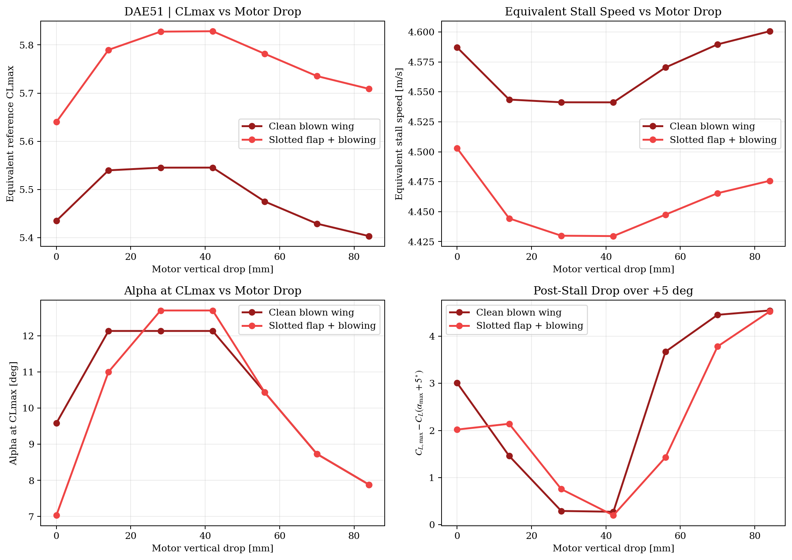
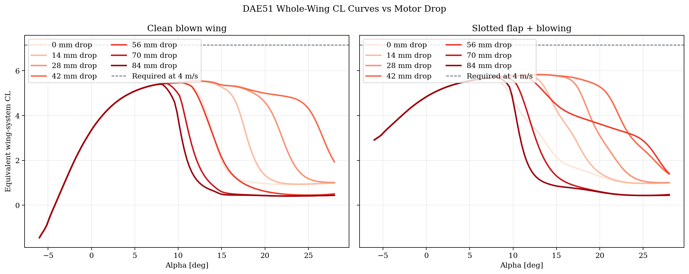
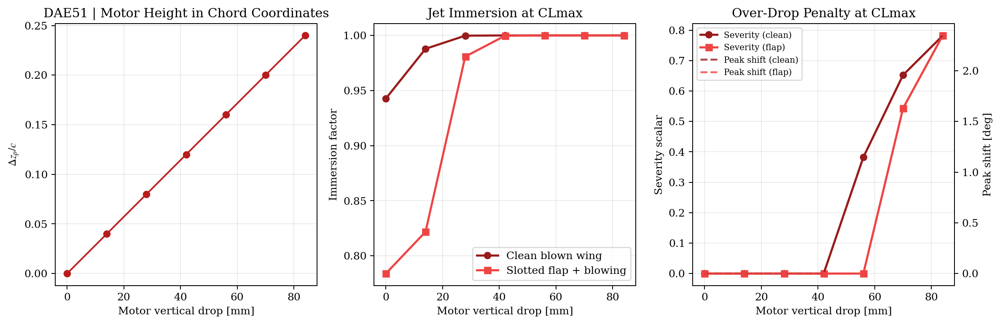

# Motor Height Trade Study: Rank 1 | DAE51

- Prop concept: `10 x 5.5 x 2.2 in`
- Scenarios compared:
  - `clean_blowing`: clean blown wing with no flap deployed
  - `slotted_flap_blowing`: slotted flap plus blowing

## Key takeaways

### Clean blown wing

- Lowest equivalent stall speed in the sweep occurred at `42 mm` drop: `4.541 m/s`.
- `CLmax` effectively saturated by about `28 mm` drop (`0.08 c`).
- The strongest modeled post-stall harshness occurred at `84 mm` drop with `poststall_drop_5deg = 4.545`.

### Slotted flap + blowing

- Lowest equivalent stall speed in the sweep occurred at `42 mm` drop: `4.430 m/s`.
- `CLmax` effectively saturated by about `28 mm` drop (`0.08 c`).
- The strongest modeled post-stall harshness occurred at `84 mm` drop with `poststall_drop_5deg = 4.523`.

## Artifacts

- Metric plot: 

- Whole-wing CL overlay: 

- Geometry/penalty plot: 

## Notes

- The selected propulsion architecture, flap geometry, and aileron geometry are held fixed while sweeping only motor vertical drop.
- The trade now combines two mechanisms: Cambridge-style jet immersion and a bounded over-drop penalty that only becomes significant near stall.
- The clean-wing and slotted-flap branches are evaluated separately so the motor-height sensitivity of each high-lift system can be compared directly.
- The over-drop penalty is still a concept-level surrogate; it is intended to reproduce the qualitative MIT-style trend that excessive drop can sharpen stall, not to claim an experimentally calibrated absolute optimum.